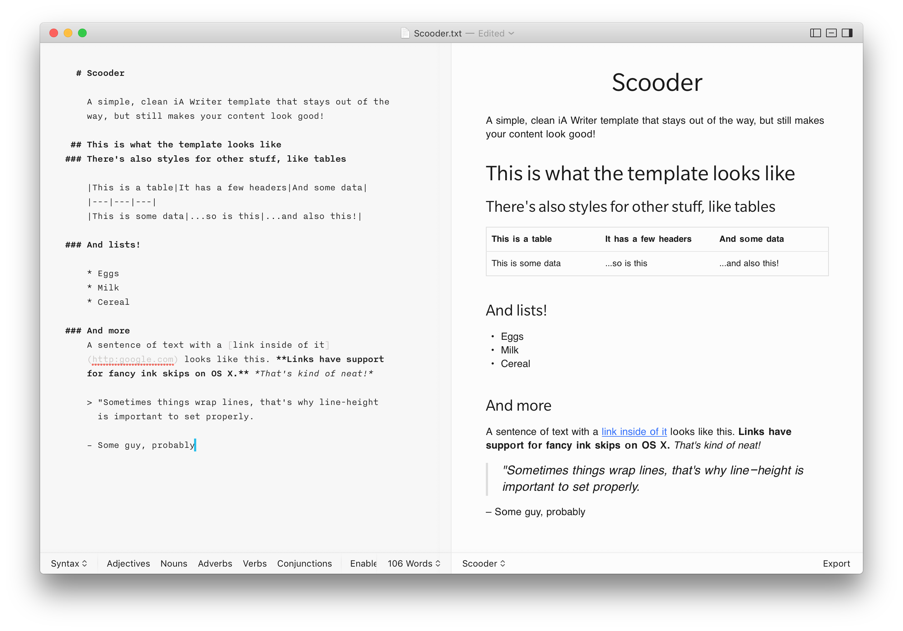

# Scooder



A simple, clean iA Writer template that stays out of the way, but still makes your content look good!

## This is what the template looks like

### There's also styles for other stuff, like tables

| This is a table   | It has a few headers | And some data     |
| ----------------- | -------------------- | ----------------- |
| This is some data | ...so is this        | ...and also this! |

### And lists!

* Eggs
* Milk
* Cereal

### And more

A sentence of text with a [link inside of it](http:google.com) looks like this. **Links have support for fancy ink skips on OS X.** _That's kind of neat!_

> "Sometimes things wrap lines, that's why line-height is important to set properly.

– Some guy, probably

```
<html>
	<h1>This is some code!</h1>
</html>
```
